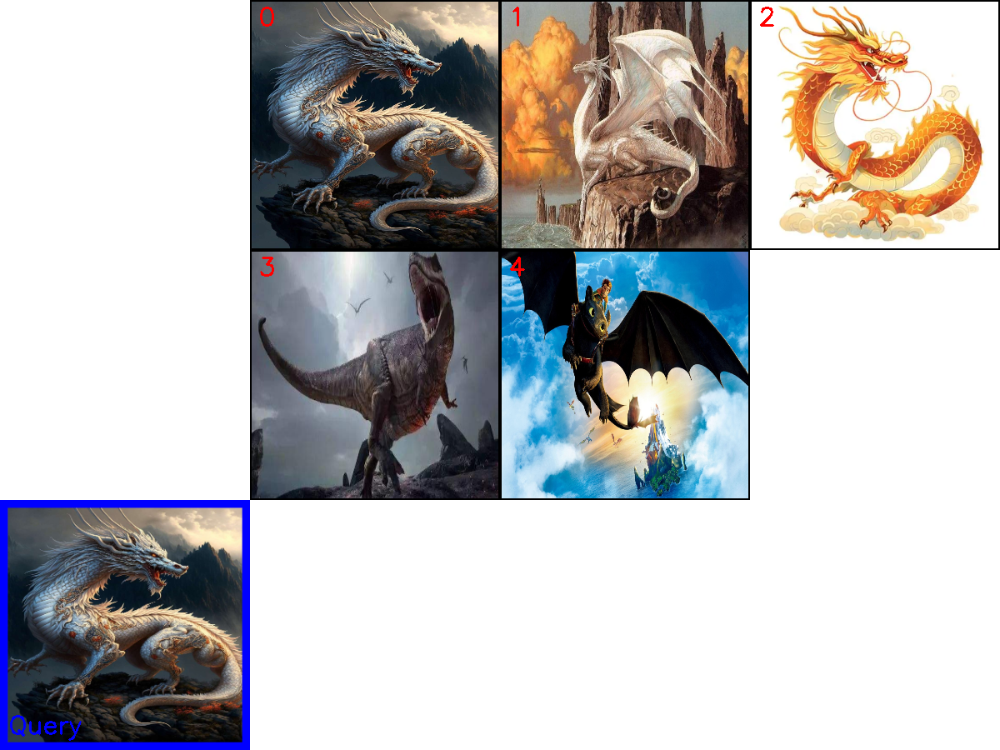

# 混合索引 笔记

## 代码
```python
import json
import os
import numpy as np
from pymilvus import connections, MilvusClient, FieldSchema, CollectionSchema, DataType, Collection, AnnSearchRequest, RRFRanker
from pymilvus.model.hybrid import BGEM3EmbeddingFunction

# 1. 初始化设置
COLLECTION_NAME = "dragon_hybrid_demo"
MILVUS_URI = "http://localhost:19530"  # 服务器模式
DATA_PATH = "../../data/C4/metadata/dragon.json"  # 相对路径
BATCH_SIZE = 50

# 2. 连接 Milvus 并初始化嵌入模型
print(f"--> 正在连接到 Milvus: {MILVUS_URI}")
connections.connect(uri=MILVUS_URI)

print("--> 正在初始化 BGE-M3 嵌入模型...")
ef = BGEM3EmbeddingFunction(use_fp16=False, device="cpu")
print(f"--> 嵌入模型初始化完成。密集向量维度: {ef.dim['dense']}")

# 3. 创建 Collection
milvus_client = MilvusClient(uri=MILVUS_URI)
if milvus_client.has_collection(COLLECTION_NAME):
    print(f"--> 正在删除已存在的 Collection '{COLLECTION_NAME}'...")
    milvus_client.drop_collection(COLLECTION_NAME)

fields = [
    FieldSchema(name="pk", dtype=DataType.VARCHAR, is_primary=True, auto_id=True, max_length=100),
    FieldSchema(name="img_id", dtype=DataType.VARCHAR, max_length=100),
    FieldSchema(name="path", dtype=DataType.VARCHAR, max_length=256),
    FieldSchema(name="title", dtype=DataType.VARCHAR, max_length=256),
    FieldSchema(name="description", dtype=DataType.VARCHAR, max_length=4096),
    FieldSchema(name="category", dtype=DataType.VARCHAR, max_length=64),
    FieldSchema(name="location", dtype=DataType.VARCHAR, max_length=128),
    FieldSchema(name="environment", dtype=DataType.VARCHAR, max_length=64),
    FieldSchema(name="sparse_vector", dtype=DataType.SPARSE_FLOAT_VECTOR),
    FieldSchema(name="dense_vector", dtype=DataType.FLOAT_VECTOR, dim=ef.dim["dense"])
]

# 如果集合不存在，则创建它及索引
if not milvus_client.has_collection(COLLECTION_NAME):
    print(f"--> 正在创建 Collection '{COLLECTION_NAME}'...")
    schema = CollectionSchema(fields, description="关于龙的混合检索示例")
    # 创建集合
    collection = Collection(name=COLLECTION_NAME, schema=schema, consistency_level="Strong")
    print("--> Collection 创建成功。")

    # 4. 创建索引
    print("--> 正在为新集合创建索引...")
    sparse_index = {"index_type": "SPARSE_INVERTED_INDEX", "metric_type": "IP"}
    collection.create_index("sparse_vector", sparse_index)
    print("稀疏向量索引创建成功。")

    dense_index = {"index_type": "AUTOINDEX", "metric_type": "IP"}
    collection.create_index("dense_vector", dense_index)
    print("密集向量索引创建成功。")

collection = Collection(COLLECTION_NAME)

# 5. 加载数据并插入
collection.load()
print(f"--> Collection '{COLLECTION_NAME}' 已加载到内存。")

if collection.is_empty:
    print(f"--> Collection 为空，开始插入数据...")
    if not os.path.exists(DATA_PATH):
        raise FileNotFoundError(f"数据文件未找到: {DATA_PATH}")
    with open(DATA_PATH, 'r', encoding='utf-8') as f:
        dataset = json.load(f)

    docs, metadata = [], []
    for item in dataset:
        parts = [
            item.get('title', ''),
            item.get('description', ''),
            item.get('location', ''),
            item.get('environment', ''),
            # *item.get('combat_details', {}).get('combat_style', []),
            # *item.get('combat_details', {}).get('abilities_used', []),
            # item.get('scene_info', {}).get('time_of_day', '')
        ]
        docs.append(' '.join(filter(None, parts)))
        metadata.append(item)
    print(f"--> 数据加载完成，共 {len(docs)} 条。")

    print("--> 正在生成向量嵌入...")
    embeddings = ef(docs)
    print("--> 向量生成完成。")

    print("--> 正在分批插入数据...")
    # 为每个字段准备批量数据
    img_ids = [doc["img_id"] for doc in metadata]
    paths = [doc["path"] for doc in metadata]
    titles = [doc["title"] for doc in metadata]
    descriptions = [doc["description"] for doc in metadata]
    categories = [doc["category"] for doc in metadata]
    locations = [doc["location"] for doc in metadata]
    environments = [doc["environment"] for doc in metadata]
    
    # 获取向量
    sparse_vectors = embeddings["sparse"]
    dense_vectors = embeddings["dense"]
    
    # 插入数据
    collection.insert([
        img_ids,
        paths,
        titles,
        descriptions,
        categories,
        locations,
        environments,
        sparse_vectors,
        dense_vectors
    ])
    
    collection.flush()
    print(f"--> 数据插入完成，总数: {collection.num_entities}")
else:
    print(f"--> Collection 中已有 {collection.num_entities} 条数据，跳过插入。")

# 6. 执行搜索
search_query = "悬崖上的巨龙"
search_filter = 'category in ["western_dragon", "chinese_dragon", "movie_character"]'
top_k = 5

print(f"\n{'='*20} 开始混合搜索 {'='*20}")
print(f"查询: '{search_query}'")
print(f"过滤器: '{search_filter}'")

query_embeddings = ef([search_query])
dense_vec = query_embeddings["dense"][0]
sparse_vec = query_embeddings["sparse"]._getrow(0)

# 打印向量信息
print("\n=== 向量信息 ===")
print(f"密集向量维度: {len(dense_vec)}")
print(f"密集向量前5个元素: {dense_vec[:5]}")
print(f"密集向量范数: {np.linalg.norm(dense_vec):.4f}")

print(f"\n稀疏向量维度: {sparse_vec.shape[1]}")
print(f"稀疏向量非零元素数量: {sparse_vec.nnz}")
print("稀疏向量前5个非零元素:")
for i in range(min(5, sparse_vec.nnz)):
    print(f"  - 索引: {sparse_vec.indices[i]}, 值: {sparse_vec.data[i]:.4f}")
density = (sparse_vec.nnz / sparse_vec.shape[1] * 100)
print(f"\n稀疏向量密度: {density:.8f}%")

# 定义搜索参数
search_params = {"metric_type": "IP", "params": {}}

# 先执行单独的搜索
print("\n--- [单独] 密集向量搜索结果 ---")
dense_results = collection.search(
    [dense_vec],
    anns_field="dense_vector",
    param=search_params,
    limit=top_k,
    expr=search_filter,
    output_fields=["title", "path", "description", "category", "location", "environment"]
)[0]

for i, hit in enumerate(dense_results):
    print(f"{i+1}. {hit.entity.get('title')} (Score: {hit.distance:.4f})")
    print(f"    路径: {hit.entity.get('path')}")
    print(f"    描述: {hit.entity.get('description')[:100]}...")

print("\n--- [单独] 稀疏向量搜索结果 ---")
sparse_results = collection.search(
    [sparse_vec],
    anns_field="sparse_vector",
    param=search_params,
    limit=top_k,
    expr=search_filter,
    output_fields=["title", "path", "description", "category", "location", "environment"]
)[0]

for i, hit in enumerate(sparse_results):
    print(f"{i+1}. {hit.entity.get('title')} (Score: {hit.distance:.4f})")
    print(f"    路径: {hit.entity.get('path')}")
    print(f"    描述: {hit.entity.get('description')[:100]}...")

print("\n--- [混合] 稀疏+密集向量搜索结果 ---")
# 创建 RRF 融合器
rerank = RRFRanker(k=60)

# 创建搜索请求
dense_req = AnnSearchRequest([dense_vec], "dense_vector", search_params, limit=top_k)
sparse_req = AnnSearchRequest([sparse_vec], "sparse_vector", search_params, limit=top_k)

# 执行混合搜索
results = collection.hybrid_search(
    [sparse_req, dense_req],
    rerank=rerank,
    limit=top_k,
    output_fields=["title", "path", "description", "category", "location", "environment"]
)[0]

# 打印最终结果
for i, hit in enumerate(results):
    print(f"{i+1}. {hit.entity.get('title')} (Score: {hit.distance:.4f})")
    print(f"    路径: {hit.entity.get('path')}")
    print(f"    描述: {hit.entity.get('description')[:100]}...")

# 7. 清理资源
milvus_client.release_collection(collection_name=COLLECTION_NAME)
print(f"已从内存中释放 Collection: '{COLLECTION_NAME}'")
milvus_client.drop_collection(COLLECTION_NAME)
print(f"已删除 Collection: '{COLLECTION_NAME}'")
```
1. 环境初始化与模型连接

连接 Milvus 服务（local server 模式，URI: http://localhost:19530）。

使用 BGEM3EmbeddingFunction 创建 BGE‑M3 嵌入功能，生成文本的密集和稀疏向量，并打印其 dense 向量维度（ef.dim['dense']）以确认模型初始化成功。

这是 Milvus 官方所推荐的用于产生 dense 和 sparse 嵌入的标准方式

2. 创建 Milvus 集合 (Collection) 及索引设置

如果已有同名 Collection，就先删除旧的。 构建新的 Collection，包括以下字段：

pk（主键，VARCHAR，auto_id）
多个 metadata 字段：img_id, path, title, description, category, location, environment
向量字段：
- sparse_vector （SPARSE_FLOAT_VECTOR）
- dense_vector （FLOAT_VECTOR，维度与 BGE‑M3 的 dense 向量一致）

为向量字段分别创建索引：

- 稀疏向量索引：SPARSE_INVERTED_INDEX，通常用于关键词匹配（类似全文检索）
- 密集向量索引：AUTOINDEX (或 FLAT)，用于语义相似性搜索


3. 数据加载与批量插入

从本地 JSON 文件 dragon.json 中加载数据（包含每条记录的 img_id, path, title, 等字段及可能的 metadata）。

通过拼接 title/description/location/environment 字段构建文档列表 docs，调用 ef(docs) 得到嵌入向量（分别为 "dense" 和 "sparse"）。

将文档对应 metadata 与向量一并批量插入 Milvus，再通过 flush() 保证数据写入。

打印插入后的实体总数（collection.num_entities）。

4. 混合搜索流程演示
a) 向量生成与信息打印
对查询 “悬崖上的巨龙” 生成 dense 和 sparse 向量，同时打印： 
- dense 向量的维度、前 5 个值、范数；
- sparse 向量的稀疏结构：非零元素数量、前 5 个非零索引和值、计算稀疏密度。
这有助于理解向量表示的结构差异和表示能力。

b) 单独 dense 搜索

使用 dense 向量进行搜索，基于 ANNSearchRequest 或 .search() 接口，检索 top‑k（这里 k=5）条结果，使用 category 过滤器筛选目标域（如 "western_dragon", "chinese_dragon", "movie_character"）。
输出每条结果的 title、score（距离）以及简短描述。

c) 单独 sparse 搜索

同样方式，使用 sparse 向量进行搜索，展示关键词匹配的结果。

d) Sparse + Dense 混合搜索

构建两个 AnnSearchRequest 请求：一个用于 dense_vector，一个用于 sparse_vector。

使用 RRFRanker（Reciprocal Rank Fusion）对结果进行融合重排序。

最终通过 collection.hybrid_search(...) 获取融合后的 top‑k 结果并打印。

这种方式准确体现了 Milvus 的 hybrid search机制——多向量域同时检索后融合结果，兼顾语义与关键词效果

## 运行结果
```text
(all-in-rag) @Irenia111 ➜ /workspaces/all-in-rag/code/C4 (main) $ python 01_hybrid_search.py
--> 正在连接到 Milvus: http://localhost:19530
--> 正在初始化 BGE-M3 嵌入模型...
Fetching 30 files: 100%|█████████████████████████████████████████████████████████| 30/30 [00:00<00:00, 73973.62it/s]
--> 嵌入模型初始化完成。密集向量维度: 1024
--> 正在创建 Collection 'dragon_hybrid_demo'...
--> Collection 创建成功。
--> 正在为新集合创建索引...
稀疏向量索引创建成功。
密集向量索引创建成功。
--> Collection 'dragon_hybrid_demo' 已加载到内存。
--> Collection 为空，开始插入数据...
--> 数据加载完成，共 6 条。
--> 正在生成向量嵌入...
You're using a XLMRobertaTokenizerFast tokenizer. Please note that with a fast tokenizer, using the `__call__` method is faster than using a method to encode the text followed by a call to the `pad` method to get a padded encoding.
--> 向量生成完成。
--> 正在分批插入数据...
--> 数据插入完成，总数: 6

==================== 开始混合搜索 ====================
查询: '悬崖上的巨龙'
过滤器: 'category in ["western_dragon", "chinese_dragon", "movie_character"]'

=== 向量信息 ===
密集向量维度: 1024
密集向量前5个元素: [-0.00353052  0.02043399 -0.04192593 -0.03036702 -0.02098158]
密集向量范数: 1.0000

稀疏向量维度: 250002
稀疏向量非零元素数量: 6
稀疏向量前5个非零元素:
  - 索引: 6, 值: 0.0659
  - 索引: 7977, 值: 0.1459
  - 索引: 14732, 值: 0.2959
  - 索引: 31433, 值: 0.1463
  - 索引: 141121, 值: 0.1587

稀疏向量密度: 0.00239998%

--- [单独] 密集向量搜索结果 ---
1. 悬崖上的白龙 (Score: 0.7214)
    路径: ../../data/C3/dragon/dragon02.png
    描述: 一头雄伟的白色巨龙栖息在悬崖边缘，背景是金色的云霞和远方的海岸。它拥有巨大的翅膀和优雅的身姿，是典型的西方奇幻生物。...
2. 中华金龙 (Score: 0.5353)
    路径: ../../data/C3/dragon/dragon06.png
    描述: 一条金色的中华龙在祥云间盘旋，它身形矫健，龙须飘逸，展现了东方神话中龙的威严与神圣。...
3. 驯龙高手：无牙仔 (Score: 0.5231)
    路径: ../../data/C3/dragon/dragon05.png
    描述: 在电影《驯龙高手》中，主角小嗝嗝骑着他的龙伙伴无牙仔在高空飞翔。他们飞向灿烂的太阳，下方是岛屿和海洋，画面充满了冒险与友谊。...

--- [单独] 稀疏向量搜索结果 ---
1. 悬崖上的白龙 (Score: 0.2254)
    路径: ../../data/C3/dragon/dragon02.png
    描述: 一头雄伟的白色巨龙栖息在悬崖边缘，背景是金色的云霞和远方的海岸。它拥有巨大的翅膀和优雅的身姿，是典型的西方奇幻生物。...
2. 中华金龙 (Score: 0.0857)
    路径: ../../data/C3/dragon/dragon06.png
    描述: 一条金色的中华龙在祥云间盘旋，它身形矫健，龙须飘逸，展现了东方神话中龙的威严与神圣。...
3. 驯龙高手：无牙仔 (Score: 0.0639)
    路径: ../../data/C3/dragon/dragon05.png
    描述: 在电影《驯龙高手》中，主角小嗝嗝骑着他的龙伙伴无牙仔在高空飞翔。他们飞向灿烂的太阳，下方是岛屿和海洋，画面充满了冒险与友谊。...

--- [混合] 稀疏+密集向量搜索结果 ---
1. 悬崖上的白龙 (Score: 0.0328)
    路径: ../../data/C3/dragon/dragon02.png
    描述: 一头雄伟的白色巨龙栖息在悬崖边缘，背景是金色的云霞和远方的海岸。它拥有巨大的翅膀和优雅的身姿，是典型的西方奇幻生物。...
2. 中华金龙 (Score: 0.0320)
    路径: ../../data/C3/dragon/dragon06.png
    描述: 一条金色的中华龙在祥云间盘旋，它身形矫健，龙须飘逸，展现了东方神话中龙的威严与神圣。...
3. 奔跑的奶龙 (Score: 0.0315)
    路径: ../../data/C3/dragon/dragon04.png
    描述: 一只Q版的黄色小恐龙，有着大大的绿色眼睛和友善的微笑。是一部动画中的角色，非常可爱。...
4. 驯龙高手：无牙仔 (Score: 0.0313)
    路径: ../../data/C3/dragon/dragon05.png
    描述: 在电影《驯龙高手》中，主角小嗝嗝骑着他的龙伙伴无牙仔在高空飞翔。他们飞向灿烂的太阳，下方是岛屿和海洋，画面充满了冒险与友谊。...
5. 霸王龙的怒吼 (Score: 0.0312)
    路径: ../../data/C3/dragon/dragon03.png
    描述: 史前时代的霸王龙张开血盆大口，发出震天的怒吼。在它身后，几只翼龙在阴沉的天空中盘旋，展现了白垩纪的原始力量。...
```


## 混合检索为何会改变排名顺序
“悬崖上的白龙”和“中华金龙”在 密集 和 稀疏 检索中的排名都很靠前，因此在 混合检索 中依旧维持优秀排名。

而“驯龙高手：无牙仔”虽然在密集（第 3）和稀疏（也第 3）中表现不错，但在混合中排到了第 4。

这种变化的核心原因，就在于 混合检索采用了排名融合机制，最常见的是 Reciprocal Rank Fusion (RRF)。
```text
--- [单独] 密集向量搜索结果 ---
3. 驯龙高手：无牙仔 (Score: 0.5231)
    路径: ../../data/C3/dragon/dragon05.png
    描述: 在电影《驯龙高手》中，主角小嗝嗝骑着他的龙伙伴无牙仔在高空飞翔。他们飞向灿烂的太阳，下方是岛屿和海洋，画面充满了冒险与友谊。...

--- [单独] 稀疏向量搜索结果 ---
3. 驯龙高手：无牙仔 (Score: 0.0639)
    路径: ../../data/C3/dragon/dragon05.png
    描述: 在电影《驯龙高手》中，主角小嗝嗝骑着他的龙伙伴无牙仔在高空飞翔。他们飞向灿烂的太阳，下方是岛屿和海洋，画面充满了冒险与友谊。...
    
--- [混合] 稀疏+密集向量搜索结果 ---
3. 奔跑的奶龙 (Score: 0.0315)
    路径: ../../data/C3/dragon/dragon04.png
    描述: 一只Q版的黄色小恐龙，有着大大的绿色眼睛和友善的微笑。是一部动画中的角色，非常可爱。...
4. 驯龙高手：无牙仔 (Score: 0.0313)
    路径: ../../data/C3/dragon/dragon05.png
    描述: 在电影《驯龙高手》中，主角小嗝嗝骑着他的龙伙伴无牙仔在高空飞翔。他们飞向灿烂的太阳，下方是岛屿和海洋，画面充满了冒险与友谊。...    
```

### 为何“无牙仔”排名下降？
1. RRF 的基本原理
RRF 会先分别给每种检索方式中的结果按排名分配一个分数：
分数 = 1 / (排名 + k)，其中 k 是一个常数（通常如 60）
你之后再把在不同方式中的这些分数 累加，作为文档的最终融合得分。排名越靠前（rank 小），得分贡献就越大


2. 为什么排名变化明显？

即便“无牙仔”在两种检索中都是第 3，但它与前两者相比可能仍有微小差距：

其他项目如“白龙”“金龙”可能在一个检索中排名第 1，另一个中也排名第 2，这让它们在 RRF 的融合得分上取得了更高优势。

RRF 的累积分数强调“多位高排名”的项目，哪怕“无牙仔”也有相对稳定的表现，它仍可能输给那些在两个列表中更靠前的条目。

换句话说：
就算“无牙仔”在两个单独检索中表现不错，但“白龙”和“金龙”可能均获得更“亮眼”的排名组合，从而在融合总榜中胜出。

### RRF 的优势与潜在影响
- 稳定性强：RRF 基于排名、不是原始分数值，避免了不同检索方式分数尺度不一致的问题
- 强调一致优表现：如果一个文档在多个检索结果里均排前列，就更容易被提升。
- 容易造成“弱环节拖累”现象：即使一个文档在两个列表中都表现尚可，如果有其他文档表现更均衡，更容易得更好排位。

这正呼应了学术研究里提出的：“混合检索中，某条路径表现较弱，即使其他路径表现好，也可能影响总成绩的”“weakest link”现象


## 多模态混合检索模式

实现代码
```python
import os
from tqdm import tqdm
from glob import glob
import torch
from visual_bge.visual_bge.modeling import Visualized_BGE
from pymilvus import (
    MilvusClient, FieldSchema, CollectionSchema, DataType,
    connections, Collection, AnnSearchRequest, RRFRanker
)
from pymilvus.model.hybrid import BGEM3EmbeddingFunction
import numpy as np
import cv2
from PIL import Image
# 1. 初始化设置
MODEL_NAME = "BAAI/bge-base-en-v1.5"
MODEL_PATH = "../../models/bge/Visualized_base_en_v1.5.pth"
DATA_DIR = "../../data/C3"
CAPTION_DIR = os.path.join(DATA_DIR, "dragon_captions")  # 可选：放每张图同名 .txt 文本
COLLECTION_NAME = "multimodal_demo"
MILVUS_URI = "http://localhost:19530"
TOP_K = 5

# 2. 定义工具 (编码器和可视化函数)
class Encoder:
    """图像/图文 -> dense 向量"""
    def __init__(self, model_name: str, model_path: str):
        self.model = Visualized_BGE(model_name_bge=model_name, model_weight=model_path)
        self.model.eval()

    def encode_query(self, image_path: str, text: str) -> list[float]:
        with torch.no_grad():
            query_emb = self.model.encode(image=image_path, text=text)
        return query_emb.tolist()[0]

    def encode_image(self, image_path: str) -> list[float]:
        with torch.no_grad():
            query_emb = self.model.encode(image=image_path)
        return query_emb.tolist()[0]

def visualize_results(query_image_path: str, retrieved_images: list, img_height: int = 300, img_width: int = 300, row_count: int = 3) -> np.ndarray:
    panoramic_width = img_width * row_count
    panoramic_height = img_height * row_count
    panoramic_image = np.full((panoramic_height, panoramic_width, 3), 255, dtype=np.uint8)
    query_display_area = np.full((panoramic_height, img_width, 3), 255, dtype=np.uint8)

    # 查询图
    query_pil = Image.open(query_image_path).convert("RGB")
    query_cv = np.array(query_pil)[:, :, ::-1]
    resized_query = cv2.resize(query_cv, (img_width, img_height))
    bordered_query = cv2.copyMakeBorder(resized_query, 10, 10, 10, 10, cv2.BORDER_CONSTANT, value=(255, 0, 0))
    query_display_area[img_height * (row_count - 1):, :] = cv2.resize(bordered_query, (img_width, img_height))
    cv2.putText(query_display_area, "Query", (10, panoramic_height - 20), cv2.FONT_HERSHEY_SIMPLEX, 1, (255, 0, 0), 2)

    # 检索图
    for i, img_path in enumerate(retrieved_images):
        row, col = divmod(i, row_count)
        start_row, start_col = row * img_height, col * img_width
        retrieved_pil = Image.open(img_path).convert("RGB")
        retrieved_cv = np.array(retrieved_pil)[:, :, ::-1]
        resized_retrieved = cv2.resize(retrieved_cv, (img_width - 4, img_height - 4))
        bordered_retrieved = cv2.copyMakeBorder(resized_retrieved, 2, 2, 2, 2, cv2.BORDER_CONSTANT, value=(0, 0, 0))
        panoramic_image[start_row:start_row + img_height, start_col:start_col + img_width] = bordered_retrieved
        cv2.putText(panoramic_image, str(i), (start_col + 10, start_row + 30), cv2.FONT_HERSHEY_SIMPLEX, 1, (0, 0, 255), 2)

    return np.hstack([query_display_area, panoramic_image])

def read_caption(image_path: str) -> str:
    """
    返回该图片的文字侧信息：优先读取 CAPTION_DIR/同名.txt；
    否则退化为文件名拆词作为标签（保证每条图片都有 sparse 文本）。
    """
    base = os.path.splitext(os.path.basename(image_path))[0]
    txt_path = os.path.join(CAPTION_DIR, base + ".txt")
    if os.path.exists(txt_path):
        with open(txt_path, "r", encoding="utf-8") as f:
            return f.read().strip()
    # fallback: 从文件名构造一些 token
    tokens = base.replace("_", " ").replace("-", " ")
    return f"{tokens} dragon image"

# 3. 初始化编码器/稀疏模型 & 客户端
print("--> 正在初始化编码器、稀疏模型和 Milvus 客户端...")
encoder = Encoder(MODEL_NAME, MODEL_PATH)
# 文本稀疏/密集（主要用其 sparse）
bge_m3 = BGEM3EmbeddingFunction(use_fp16=False, device="cpu")

milvus_client = MilvusClient(uri=MILVUS_URI)

# 4. 创建 Milvus Collection（包含 dense+ sparse）
print(f"\n--> 正在创建 Collection '{COLLECTION_NAME}'")
if milvus_client.has_collection(COLLECTION_NAME):
    milvus_client.drop_collection(COLLECTION_NAME)
    print(f"已删除已存在的 Collection: '{COLLECTION_NAME}'")

image_list = glob(os.path.join(DATA_DIR, "dragon", "*.png"))
if not image_list:
    raise FileNotFoundError(f"在 {DATA_DIR}/dragon/ 中未找到任何 .png 图像。")
dim_dense = len(encoder.encode_image(image_list[0]))

fields = [
    FieldSchema(name="id", dtype=DataType.INT64, is_primary=True, auto_id=True),
    FieldSchema(name="image_dense", dtype=DataType.FLOAT_VECTOR, dim=dim_dense),  # 图像/图文 dense
    FieldSchema(name="text_sparse", dtype=DataType.SPARSE_FLOAT_VECTOR),          # 文本 sparse（BGE-M3）
    FieldSchema(name="image_path", dtype=DataType.VARCHAR, max_length=512),
    FieldSchema(name="text_meta", dtype=DataType.VARCHAR, max_length=4096),
]

schema = CollectionSchema(fields, description="多模态图文混合检索（dense + sparse + RRF）")
milvus_client.create_collection(collection_name=COLLECTION_NAME, schema=schema)
print(f"成功创建 Collection: '{COLLECTION_NAME}'")
print(milvus_client.describe_collection(collection_name=COLLECTION_NAME))

# 5. 准备并插入数据（同时生成 dense & sparse）
print(f"\n--> 正在向 '{COLLECTION_NAME}' 插入数据（dense + sparse）")
data_to_insert = []
text_corpus = []  # 为了批量调用 BGE-M3 生成稀疏向量
for image_path in image_list:
    text_corpus.append(read_caption(image_path))

# 批量获得 text 的稀疏/密集（我们此处主要用 sparse）
print("--> 生成文本稀疏向量（BGE-M3）...")
text_embeds = bge_m3(text_corpus)  # 返回 {"dense": [...], "sparse": <scipy.sparse>}
sparse_matrix = text_embeds["sparse"]  # CSR 矩阵

# 逐条生成图像 dense，并采集对应 sparse 行
print("--> 生成图像 dense 向量并拼装插入数据...")
for idx, image_path in enumerate(tqdm(image_list, desc="编码 & 组装")):
    dense_vec = encoder.encode_image(image_path)
    # 从稀疏矩阵中取该行（Milvus Python 客户端支持直接放入 SPARSE_FLOAT_VECTOR 的行对象）
    sparse_vec = sparse_matrix._getrow(idx)
    meta_text = text_corpus[idx]

    data_to_insert.append({
        "image_dense": dense_vec,
        "text_sparse": sparse_vec,
        "image_path": image_path,
        "text_meta": meta_text,
    })

if data_to_insert:
    result = milvus_client.insert(collection_name=COLLECTION_NAME, data=data_to_insert)
    print(f"成功插入 {result['insert_count']} 条数据。")

# 6. 为两个向量域分别建索引并加载
print(f"\n--> 正在为 '{COLLECTION_NAME}' 创建索引")
index_params = milvus_client.prepare_index_params()
index_params.add_index(
    field_name="image_dense",
    index_type="HNSW",
    metric_type="COSINE",
    params={"M": 16, "efConstruction": 256}
)
index_params.add_index(
    field_name="text_sparse",
    index_type="SPARSE_INVERTED_INDEX",   # 稀疏向量倒排索引
    metric_type="IP",                     # 常用 IP
    params={}
)
milvus_client.create_index(collection_name=COLLECTION_NAME, index_params=index_params)
milvus_client.load_collection(collection_name=COLLECTION_NAME)
print("索引创建完成并已加载到内存。")

# 7. 执行“混合检索”：dense(图文) + sparse(文本) + RRF 融合
print(f"\n--> 正在 '{COLLECTION_NAME}' 中执行混合检索（dense + sparse + RRF）")

query_image_path = os.path.join(DATA_DIR, "dragon", "query.png")
query_text = "一条龙"  # 可改成更具体的描述
# 图文 dense（你的模型）
query_dense = encoder.encode_query(image_path=query_image_path, text=query_text)
# 文本 sparse（BGE-M3）
query_sparse = bge_m3([query_text])["sparse"]._getrow(0)

# 使用 ORM 的 hybrid_search（通过 Collection + AnnSearchRequest + RRFRanker）
# 说明：MilvusClient 也有 hybrid_search API，但这里用 ORM 以便演示 AnnSearchRequest 与 RRF。详见文档。

# ✅ 给 ORM 建立连接（alias 默认是 "default"）
connections.connect(alias="default", uri=MILVUS_URI)

collection = Collection(COLLECTION_NAME)

dense_req = AnnSearchRequest(
    data=[query_dense],
    anns_field="image_dense",
    param={"metric_type": "COSINE", "params": {"ef": 128}},
    limit=TOP_K
)
sparse_req = AnnSearchRequest(
    data=[query_sparse],
    anns_field="text_sparse",
    param={"metric_type": "IP", "params": {}},
    limit=TOP_K
)

# RRF 重排（k 可按需调大些以增强融合效果）
reranker = RRFRanker(k=60)

results = collection.hybrid_search(
    reqs=[dense_req, sparse_req],
    rerank=reranker,
    limit=TOP_K,
    output_fields=["image_path", "text_meta"]
)[0]

retrieved_images = []
print("混合检索结果（RRF 后）：")
for i, hit in enumerate(results):
    img_path = hit.entity.get("image_path")
    meta = hit.entity.get("text_meta")
    print(f"  Top {i+1}: ID={hit.id}, 距离={hit.distance:.4f}, 路径='{img_path}' | 文本='{meta[:60]}...'")
    if img_path:
        retrieved_images.append(img_path)

# 8. 可视化与清理
print(f"\n--> 正在可视化结果并清理资源")
if not retrieved_images:
    print("没有检索到任何图像。")
else:
    pano = visualize_results(query_image_path, retrieved_images)
    combined_image_path = os.path.join(DATA_DIR, "search_result_hybrid.png")
    cv2.imwrite(combined_image_path, pano)
    print(f"结果图像已保存到: {combined_image_path}")
    Image.open(combined_image_path).show()

milvus_client.release_collection(collection_name=COLLECTION_NAME)
print(f"已从内存中释放 Collection: '{COLLECTION_NAME}'")
milvus_client.drop_collection(COLLECTION_NAME)
print(f"已删除 Collection: '{COLLECTION_NAME}'")

```
运行结果
```text

--> 正在 'multimodal_demo' 中执行混合检索（dense + sparse + RRF）
混合检索结果（RRF 后）：
  Top 1: ID=460494293733475940, 距离=0.0164, 路径='../../data/C3/dragon/query.png' | 文本='query dragon image...'
  Top 2: ID=460494293733475941, 距离=0.0161, 路径='../../data/C3/dragon/dragon02.png' | 文本='dragon02 dragon image...'
  Top 3: ID=460494293733475942, 距离=0.0159, 路径='../../data/C3/dragon/dragon06.png' | 文本='dragon06 dragon image...'
  Top 4: ID=460494293733475943, 距离=0.0156, 路径='../../data/C3/dragon/dragon03.png' | 文本='dragon03 dragon image...'
  Top 5: ID=460494293733475938, 距离=0.0154, 路径='../../data/C3/dragon/dragon05.png' | 文本='dragon05 dragon image...'

--> 正在可视化结果并清理资源
结果图像已保存到: ../../data/C3/search_result_hybrid.png
```



多模态单一检索结果
```text
--> 正在为 'multimodal_demo' 创建索引
成功为向量字段创建 HNSW 索引。
索引详情:
{'M': '16', 'efConstruction': '256', 'metric_type': 'COSINE', 'index_type': 'HNSW', 'field_name': 'vector', 'index_name': 'vector', 'total_rows': 0, 'indexed_rows': 0, 'pending_index_rows': 0, 'state': 'Finished'}
已加载 Collection 到内存中。

--> 正在 'multimodal_demo' 中执行检索
检索结果:
  Top 1: ID=460494293733475948, 距离=0.9466, 路径='../../data/C3/dragon/query.png'
  Top 2: ID=460494293733475949, 距离=0.7443, 路径='../../data/C3/dragon/dragon02.png'
  Top 3: ID=460494293733475950, 距离=0.6851, 路径='../../data/C3/dragon/dragon06.png'
  Top 4: ID=460494293733475951, 距离=0.6049, 路径='../../data/C3/dragon/dragon03.png'
  Top 5: ID=460494293733475946, 距离=0.5360, 路径='../../data/C3/dragon/dragon05.png'

--> 正在可视化结果并清理资源
结果图像已保存到: ../../data/C3/search_result.png
<PIL.PngImagePlugin.PngImageFile image mode=RGB size=1200x900 at 0x7BC54EB6C260>
```


现在的实验场景（小而同质、文本稀疏信息弱、包含自匹配）让两路排名天然接近；RRF 又只看名次，所以“看起来没区别”。

### 为什么几乎一样？

1. 查询图片被索引进库
把 query.png 也插入了库，所以不管 dense 还是 hybrid，Top1 都会是它本身；其余几张龙图也非常相似，自然两种检索的前几名就趋同。这是任何向量检索都会出现的“自匹配”。（Milvus 的混合检索只是把多路排名融合，并不会“避免自匹配”。）

2. 稀疏通道信息太弱（文件名 token）
给每张图的稀疏向量只是由文件名衍生的“dragon06 dragon image”这类 token。这样一来，所有图片在稀疏通道上几乎同分，稀疏排名和 dense 排名就非常接近，RRF 融合后自然“像没融合”。Milvus 官方也强调，BGE-M3 的 sparse 要配高质量文本（标题/说明/标签）才会拉开差距。


3. RRF 只看“名次”，不看“分数”
RRF（Reciprocal Rank Fusion）的公式是把各通道的排名位次做 1/(k+rank) 的求和；如果两路各自的 Top-K 列表本来就高度重合，那么融合后也几乎不变。日志里的 0.015~0.016 不是余弦相似度，而是 RRF 聚合出的分值（量级小很正常）。

4. 数据集太小、同类过于集中
全是“龙”的图片，语义和关键词都很近。混合检索的优势通常体现在异质（语义 vs 关键词）或跨模态（图 vs 文）场景，或者文本里包含能区分的细粒度线索。